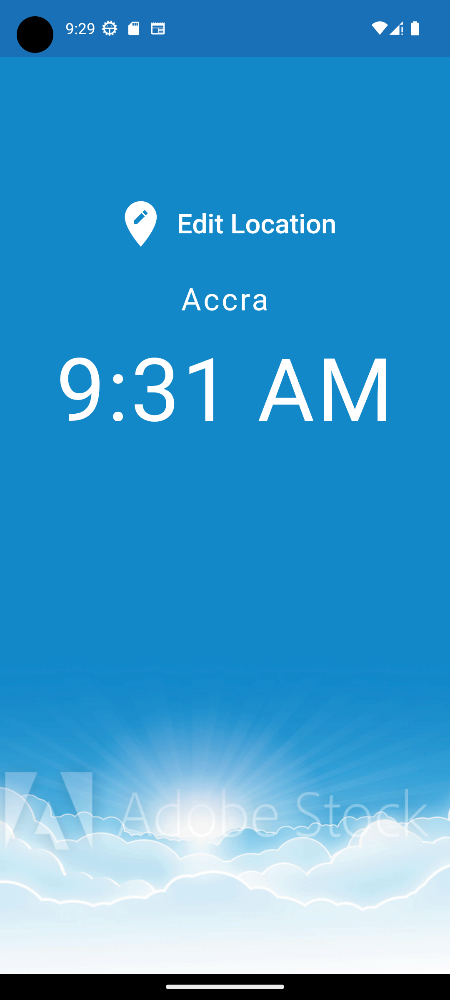
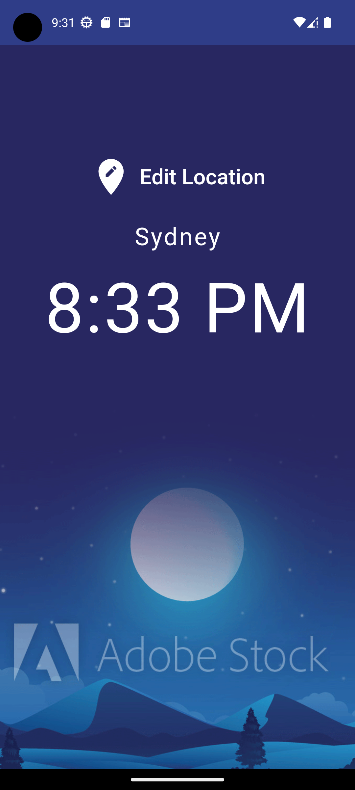
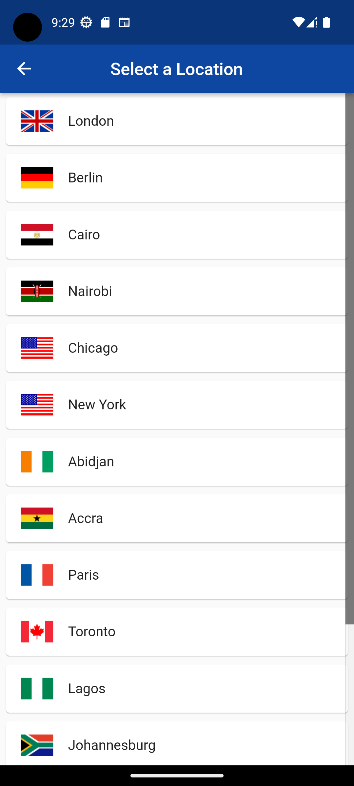

# world_clock

Check the time of various select cities, built with Flutter

## Main Screen

Show the time of a selected city.
 
 

## Image changes depending of time of day

Daytime
 
 

Nighttime
 
 

## Choose from a list of cities

Select a city from the list.

# Select a city

